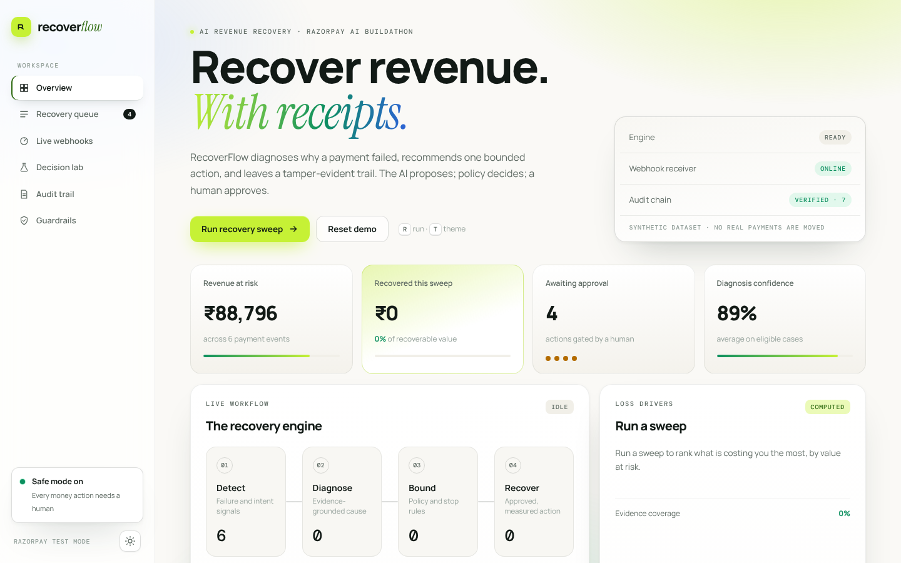
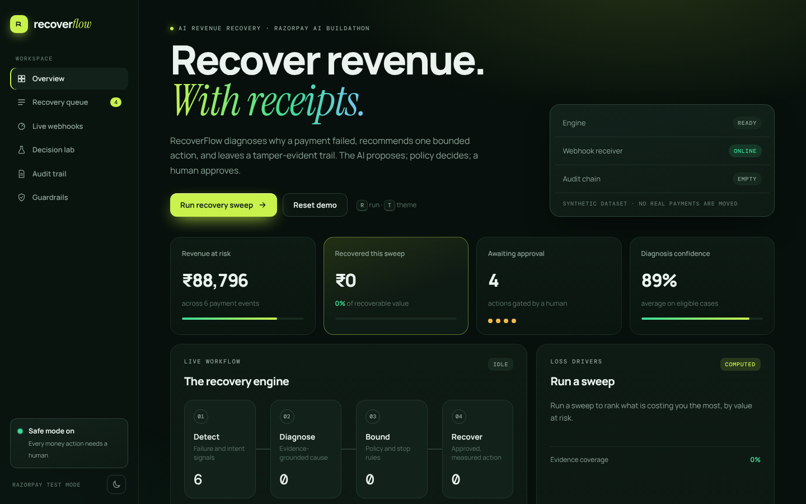
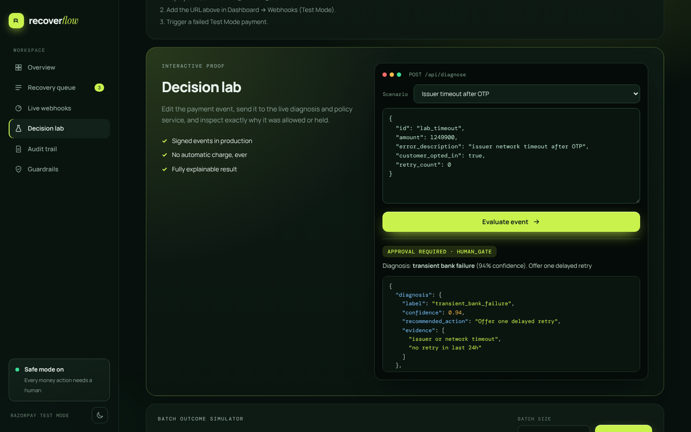
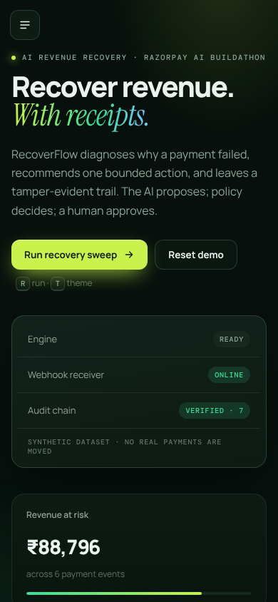

<div align="center">

# ⚡ RecoverFlow

### Policy-First AI Revenue Recovery & Payment Protection Engine

[](https://nodejs.org)
[](https://razorpay.com)
[](https://github.com/karthik1122-code/recoverflow)
[](LICENSE)

<br />

**A policy-first AI revenue recovery agent built for Razorpay AI Buildathon — Track 03: AI Revenue Recovery.**

### [▶ Live demo — recoverflow-ten.vercel.app](https://recoverflow-ten.vercel.app) · [Dashboard](https://recoverflow-ten.vercel.app/app.html)

Synthetic data only · Razorpay Test Mode · every money action needs human approval

</div>

---

RecoverFlow finds revenue at risk, diagnoses the probable cause from payment and customer-intent signals, recommends one bounded recovery action, and preserves an audit trail for every decision.

## Accounts and roles

Sign-in is on by default. The first visit to `/login.html` shows a setup screen that creates the administrator; set `SETUP_TOKEN` before deploying so a stranger who finds the URL first cannot claim that account. Administrators add people at `/team.html`.

| Role | Can do |
|---|---|
| viewer | read the dashboard, metrics and audit trail |
| approver | also run diagnoses and draft messages |
| admin | also manage people and create test payment links |

`POST /webhooks/razorpay` never needs a session; it is protected by the Razorpay signature. Passwords use scrypt, sessions are random tokens stored only as SHA-256 hashes, cookies are `HttpOnly; SameSite=Strict`, writes under `/api` need a custom `x-ag-csrf` header, and repeated failed logins lock that email and address for 15 minutes. `AUTH=off` serves the synthetic demo with no sign-in (used for the public showcase); never use it with real data.

Limits: email and password only, with no verification email, password reset, SSO or two-factor yet; login throttling is in memory and resets on restart.

## Why this matters

Revenue loss is rarely a single failure: a payment can time out after OTP, a subscription mandate can fail, a B2B invoice can go overdue, or an otherwise high-intent checkout can be abandoned. Generic retries and mass reminders waste customer trust. RecoverFlow chooses the *least intrusive action that is justified by evidence*.

## Screenshots


| Light (default) | Dark |
|---|---|
|  |  |

| Decision lab | Mobile |
|---|---|
|  |  |

## Demo

Run the local app, then press **Run recovery sweep**. Review any intervention and approve it to see the recovered-value metric and immutable decision trail update.

No network, credentials, or real payment data are used. The app ships with deliberately synthetic payment records.

## System design

```
Payment / checkout events
        ↓
Signal normalizer → diagnosis model → policy engine → human approval gate
        ↓                                      ↓
  evidence + confidence                    audit event
        ↓
bounded recovery executor → outcome measurement
```

### AI boundary

The agent may classify a cause and draft an intervention, but it does **not** execute money-impacting actions autonomously. A deterministic policy layer checks confidence, consent, retry limits, dispute/duplicate flags, and amount thresholds before presenting an action for approval.

In production, the diagnosis stage can use an LLM with structured JSON output plus a calibrated classifier. This prototype keeps its rules and synthetic data visible for a reproducible, explainable demo.

## Guardrails

- At most one retry within 24 hours.
- No customer contact after opt-out.
- No automatic payment, refund, or retry execution.
- Duplicate-charge and low-confidence cases are held for a human.
- Every decision includes source evidence and its policy result.

## Metrics shown

- Revenue at risk and recovered amount
- Recovery rate across the batch
- AI confidence on eligible recommendations
- Actions withheld by policy
- Evidence coverage

## What broke, and how we handled it

Initially, the recovery logic treated any payment failure as a retry candidate. That would have retried a failed mandate repeatedly and may have contacted customers with a suspected duplicate charge. We added a policy engine that blocks retry-limit breaches, low-confidence diagnoses, and duplicate/dispute signals. Held cases now remain visible in the exception queue instead of being silently dropped.

## Buildathon submission checklist

- [ ] Publish this directory as a public GitHub repository.
- [ ] Add a short screen recording / deployment link to this README.
- [ ] Record a five-minute pitch: problem → live sweep → approval gate → metrics → architecture → failure recovery.
- [ ] Replace the synthetic-demo outcome label with a real test-mode integration only if you can validate it end-to-end.

## Evaluation

`npm run evaluate` runs a fixed 21-record synthetic **held-out scenario** suite covering transient failures, insufficient funds, mandates, duplicates, retry limits, unknown errors, and consent refusal. It reports diagnosis accuracy, policy-assertion accuracy, approval/hold counts, and a clearly labelled conservative recovery simulation. This is regression coverage, **not** a claim of live merchant performance.

### Hard set (stress test)

`npm run evaluate:hard` runs 47 hand-written cases with paraphrases, typos, Hinglish, refund messages, conflicting signals, consent and the high-value boundary. It prints per-class precision and recall, a confusion matrix and every miss. The cases were written by the author, so this is a stress and regression set, not production data.

| | First run | After rule fixes |
|---|---|---|
| Diagnosis accuracy | 72.3% (34/47) | 97.9% (46/47) |
| Unsafe actions (a case that must be held got queued for a customer) | 2 | 0 |

What the first run found: the pattern `fund` matched "Refund processed" and "Funds transfer reversal", so the engine would have queued a payment reminder for a refund. Other misses were paraphrases ("not responding", "timed out", "not enough money"). The fixes were word-aware patterns and an explicit refund/reversal guard. The one remaining miss is intentional: "Refund initiated; original card has expired" is held for a human. The accuracy figure was measured on the same cases used to fix the rules, so treat it as a regression gate, not a prediction of live accuracy. CI fails if an unsafe action appears or accuracy drops under 95%.

## Quality bar

- `npm test` validates core safety rules.
- `npm run evaluate` produces reproducible benchmark output.
- GitHub Actions runs both checks on every push.
- The only runtime dependency is `pg`, and it is loaded only when `DATABASE_URL` is set. Without it the app runs in memory with zero dependencies.

## Deployment

The repository includes a Render blueprint and a step-by-step [deployment runbook](DEPLOY.md). It deploys the webhook receiver over HTTPS while keeping Test Mode secrets in the host's environment-variable store.

## Buildathon application

Use [SUBMISSION.md](SUBMISSION.md) for the form answers and five-minute demo flow.

## Project layout

```
server.mjs        HTTP server: API, webhook receiver, static files (public/ only)
core.mjs          diagnose() + policyDecision(); HIGH_VALUE_PAISE = 50_000_000 (₹5,00,000)
webhook.mjs       HMAC verification + Razorpay payload evaluation
audit.mjs         hash-chained audit log      idempotency.mjs  stable event keys
metrics.mjs       process counters behind /api/metrics
store.mjs         in-memory store: atomic webhook commit (claim + record + audit, or nothing)
pg-store.mjs      same contract on Postgres, one transaction per webhook
messages.mjs      consent-safe message drafts (English / Hinglish)
public/           index.html (landing) + app.html (dashboard) and assets — the only directory served
```

Amounts are always integers in **paise**.

## UI

Two pages: a motion-rich landing page at `/` (kinetic headline, live engine stream that calls the real `/api/diagnose`, scroll reveals, tilt/magnetic interactions, reduced-motion aware) and the dashboard at `/app.html`.

Light-first dashboard with a dark theme toggle, animated recovery sweep, approval gate, live webhook feed and audit-chain verification, a Decision lab that posts editable events to `/api/diagnose`, and a batch simulator. Sweep classifications and the live feed come from the real engine/API; the batch simulator uses clearly labelled illustrative constants. Shortcuts: `R` run sweep, `T` toggle theme.

## Reliability

Webhook handling is built to be safe to retry:

- **Atomic commit.** The idempotency key, the event record and its audit entry are committed together. If processing fails part-way, the key is released and nothing is recorded, so the sender's retry is processed normally.
- **Concurrent duplicates.** Duplicates that arrive while the first attempt is still running are not processed twice. Tests fire 200 simultaneous deliveries at the store and 50 at the HTTP endpoint and assert exactly one record.
- **No key collisions.** If a payload has no entity id or timestamp, the key falls back to a fingerprint of the raw body, so two different events never share a key.
- **Audit chain after trimming.** When old records are dropped to cap memory, the hash of the last dropped record is kept as a checkpoint, so the retained chain still verifies and tampering is still detected.

### Observability

`GET /api/metrics` returns counters for this running instance (received, accepted, duplicates blocked, signature failures, processing errors), deliveries per minute for the last 30 minutes, the storage backend, and a breakdown of recorded events by diagnosis and policy code. The dashboard shows the same data in the Webhook health card. Counters live in memory and reset on restart; the events and audit chain are what persist.

### Persistence

Set `DATABASE_URL` and the server uses Postgres; leave it unset and it runs in memory (state resets on restart).

- The idempotency key is a primary key. The key, event and audit record are inserted in a single transaction, so a crash leaves nothing half-written.
- A duplicate that arrives while the first attempt is still running waits on the unique index. If the first attempt commits, the duplicate is dropped; if it rolls back, the duplicate is processed. The database enforces this, not application code.
- Audit appends are serialised with an advisory lock, so two writers can never link to the same previous hash.
- `GET /api/audit` returns the latest 500 records plus an anchor hash, so the window still verifies.
- Tests in `pg-store.test.mjs` run against a real database when `TEST_DATABASE_URL` is set (skipped otherwise): 200 concurrent duplicates, rollback and retry, a duplicate racing a failing attempt, restart persistence, and tamper detection on a window.

## Security notes

- Only `public/` is served; source files, `.env` and the audit file are never reachable.
- Strict CSP and security headers; request bodies capped at 100 KB; in-memory records capped at 500.
- Webhooks require a valid `X-Razorpay-Signature`; duplicates are ignored.
- `POST /api/create-test-payment-link` is **off by default**. Set `ENABLE_TEST_LINKS=true` on a private deployment; only `rzp_test_` keys are accepted and the amount is clamped.
- If an earlier version of this server was ever deployed publicly with a `.env`, rotate those Test Mode secrets.

## Local development

The HTTP server uses Node's built-in modules. Run `npm ci` once to install `pg`; it is only used when `DATABASE_URL` is set:

```bash
cd recoverflow
npm test          # unit + server integration tests
npm run evaluate  # synthetic held-out scenario suite
npm run dev
```

Open `http://localhost:4173`.

### Razorpay test-mode proof

The optional integration server verifies the `X-Razorpay-Signature` HMAC before accepting `payment.failed`, `subscription.pending`, or `subscription.halted` webhooks. It also has a server-only endpoint for generating a **Test Mode** Payment Link; credentials stay in `.env` and never reach the browser.

1. Copy `.env.example` to `.env` and add Test Mode credentials only. The local `.env` file is excluded from Git.
2. Start the app with `npm run dev`; it loads `.env` automatically when present.
3. Expose your local server with a public HTTPS tunnel and configure its `/webhooks/razorpay` endpoint in the Razorpay Test Mode Dashboard.
4. Create a test Payment Link and select a test failure. The signed webhook becomes an evaluated RecoverFlow record.

Razorpay documents that `payment.failed` webhooks are the correct server-side signal for failed payment automation, distinct from a client callback. Test Mode Payment Links explicitly support choosing a success or failure flow. [Payment webhooks](https://razorpay.com/docs/webhooks/payments/) · [Test-mode Payment Links](https://razorpay.com/docs/payments/payment-links/create/)
